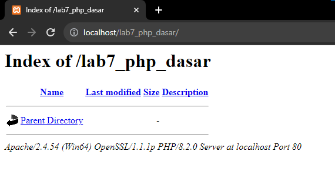
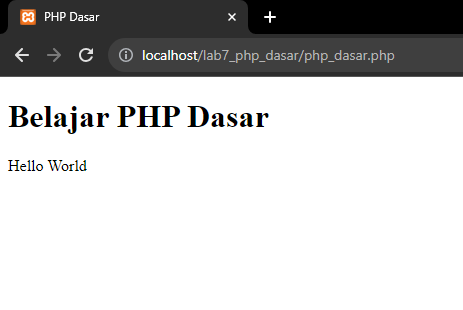
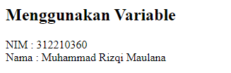
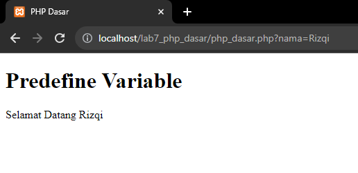
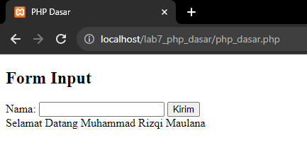
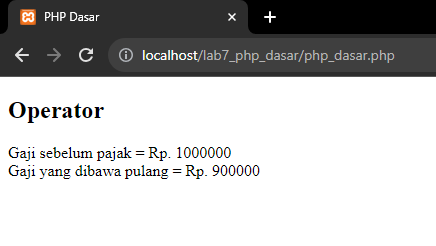
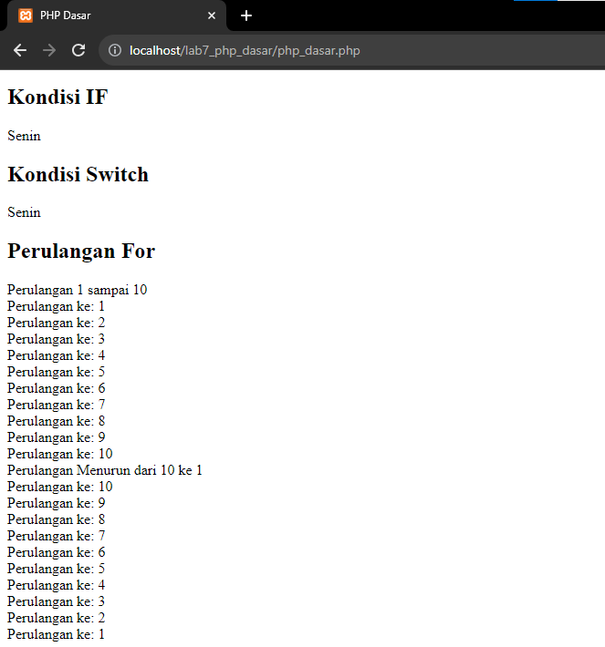
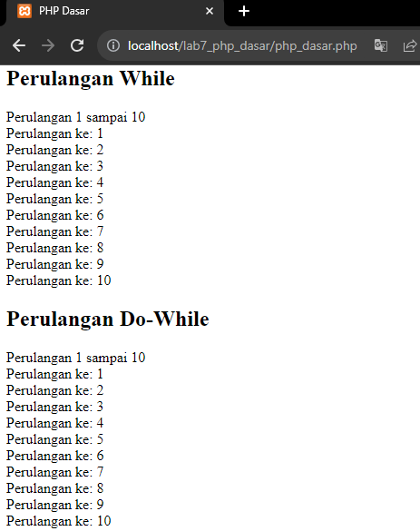
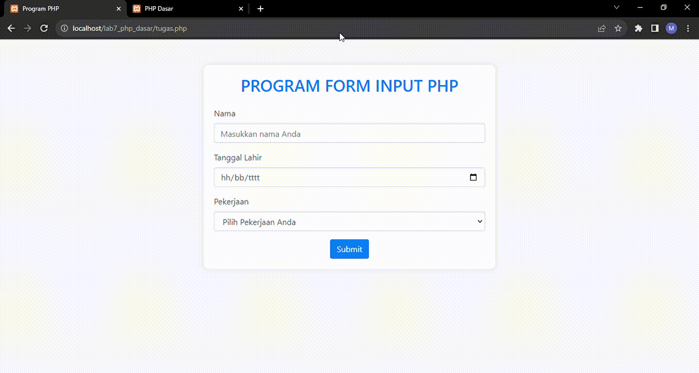

# Lab7Web

|  |  |  |
|-----|------|-----|
|Nama|Muhammad Rizqi Maulana|
|NIM|312210360|
|Kelas|TI.22.A.4|
|Mata Kuliah|Pemograman Web|

## Pengantar PHP
PHP adalah singkatan dari PHP Hypertext Prepocessor dan merupakan bahasa pemrograman yang di desain khusus untuk web development atau pengembangan web. PHP memiliki sifat Server-Side karena PHP dijalankan atau di eksekusi dari sisi server. Maksud di jalankan dari sisi server adalah PHP di jalankan pada komputer server dan bukan pada komputer client. PHP di jalankan melalui aplikasi web browser sama halnya seperti HTML. Hampir semua situs-situs besar dan populer di kembangkan menggunakan PHP. seperti misalnya wordpress, joomla, facebook, twitter, wikipedia dan situs besar lainnya.

## Instruksi Praktikum
1. Persiapkan text editor misalnya **VSCode**.
2. Buat folder baru dengan nama **lab7_php_dasar** pada docroot webserver (**htdocs**)
3. Ikuti langkah-langkah praktikum yang akan dijelaskan berikutnya.

## Langkah-langkah Praktikum

1. **Persiapan**
    - Untuk memulai membuat kode php, perlu disiapkan web server dan interpreter PHP terlebih dahulu. Web servar yang kita gunakan adalah Apache 2 dan interpreter PHP 7. Untuk memudahkan proses praktikum, kita gunakan aplikasi bundle web server yaitu XAMPP.

2. **Install XAMPP**
    - Unduh **XAMPP** dari https://www.apachefriends.org/download.html dan pilih versi portable untuk memudahkan proses installasi. Kemudian extract file tersebut, seusikan direktorinya (misal: **c:\xampp**).

3. **Memulai PHP**
    - Buat folder **lab7_php_dasar** pada root directory web server (**c:\xampp\htdocs**)
    - Kemudian untuk mengakses direktory tersebut pada web server dengan mengakses URL:http://localhost/lab7_php_dasar/<br>
    <br>
    <br>

4. **PHP Dasar**
    - Buat file baru dengan nama **php_dasar.php** pada directory tersebut. Kemudian buat kode seperti berikut.

    ```html
    <!DOCTYPE html>
    <html lang="en">
    <head>
        <meta charset="UTF-8">
        <title>PHP Dasar</title>
    </head>
    <body>
        <h1>Belajar PHP Dasar</h1>
        <?php
            echo "Hello World";
        ?>
    </body>
    </html>
    ```

    - Kemudian untuk mengakses hasilnya melalui URL:http://localhost/lab7_php_dasar/php_dasar.php<br>
    <br>
    <br>

5. **Variable PHP**. Menambahkan variable pada program
    ```php
    <h2>Menggunakan Variable</h2>
    <?php
    $nim = "0411500400";
    $nama = 'Abdullah';
    echo "NIM : " . $nim . "<br>";
    echo "Nama : $nama";
    ?>
    ```
    <br>
    <br>

6. **Predefine Variable $_GET**
    - Kemudian untuk mengakses hasilnya tambahkan di Link (**?nama=Rizqi**) melalui URL:http://localhost/lab7_php_dasar/php_dasar.php?nama=Rizqi
    ```php
    <h2>Predefine Variable</h2>
    <?php
    echo 'Selamat Datang ' . $_GET['nama'];
    ?>
    ```
    <br>

7. **Membuat Form Input**
    ```html
    <!DOCTYPE html>
    <html lang="en">
    <head>
        <meta charset="UTF-8">
        <title>PHP Dasar</title>
    </head>
    <body>
        <h2>Form Input</h2>
        <form method="post">
            <label>Nama: </label>
            <input type="text" name="nama">
            <input type="submit" value="Kirim">
        </form>
        <?php
        echo 'Selamat Datang ' . $_POST['nama'];
        ?>
    </body>
    </html>
    ```
    <br>
    <br>

8. **Operator**
    ```php
    <?php
    $gaji = 1000000;
    $pajak = 0.1;
    $thp = $gaji - ($gaji*$pajak);
    echo "Gaji sebelum pajak = Rp. $gaji <br>";
    echo "Gaji yang dibawa pulang = Rp. $thp";
    ?>
    ```
    <br>
    <br>

9. **Kondisi IF, Kondisi Switch, Perulangan FOR**
    - Operator
    ```php
    <?php
    $nama_hari = date("l");
    if ($nama_hari == "Sunday") {
        echo "Minggu";
    } elseif ($nama_hari == "Monday") {
        echo "Senin";
    } else {
        echo "Selasa";  
    }
    ?>
    ```
    - Kondisi Switch
    ```php
    <?php
    $nama_hari = date("l");
    switch ($nama_hari) {
        case "Sunday":
            echo "Minggu";
            break;
        case "Monday":
            echo "Senin";
            break;
        case "Tuesday":
            echo "Selasa";
            break;
        default:
            echo "Sabtu";
    }
    ?>
    ```
    - Perulangan FOR
    ```php
    <?php
    echo "Perulangan 1 sampai 10 <br />";
    for ($i=1; $i<=10; $i++) {
        echo "Perulangan ke: " . $i . '<br />';
    }
    echo "Perulangan Menurun dari 10 ke 1 <br />";
    for ($i=10; $i>=1; $i--) {
        echo "Perulangan ke: " . $i . '<br />';
    }
    ?>
    ```
    <br>
    <br>

10. **Perulangan WHILE & DO-WHILE**
    - Perulangan WHILE
    ```php
    <?php
    echo "Perulangan 1 sampai 10 <br />";
    $i=1;
    while ($i<=10) {
        echo "Perulangan ke: " . $i . '<br />';
        $i++;
    }
    ?>
    ```
    - DO-WHILE
    ```php
    <?php
    echo "Perulangan 1 sampai 10 <br />";
    $i=1;
    do {
        echo "Perulangan ke: " . $i . '<br />';
        $i++;
    } while ($i<=10);
    ?>
    ```
    <br>
    <br>

## Pertanyaan & Tugas
Buatlah program PHP sederhana dengan menggunakan form input yang menampilkan nama, tanggal lahir dan pekerjaan. Kemudian tampilkan outputnya dengan menghitung umur berdasarkan inputan tanggal lahir. Dan pilihan pekerjaan dengan gaji yang berbeda-beda sesuai pilihan pekerjaan. <br>

```html
<!DOCTYPE html>
<html lang="en">
<head>
    <meta charset="UTF-8">
    <meta name="viewport" content="width=device-width, initial-scale=1.0">
    <title>Program PHP</title>
    <!-- Bootstrap CSS -->
    <link rel="stylesheet" href="https://stackpath.bootstrapcdn.com/bootstrap/4.3.1/css/bootstrap.min.css">

    <style>
        body {
            background-color: #f8f9fa;
        }

        .container {
            margin-top: 50px;
        }

        .form-container {
            background-color: #fff;
            border-radius: 10px;
            box-shadow: 0 0 10px rgba(0, 0, 0, 0.1);
            padding: 20px;
        }

        h2 {
            color: #007bff;
        }

        label {
            color: #495057;
        }

        .btn-primary {
            background-color: #007bff;
            border-color: #007bff;
        }

        .btn-primary:hover {
            background-color: #0056b3;
            border-color: #0056b3;
        }

        .alert {
            margin-top: 20px;
        }
    </style>
</head>
<body>

<div class="container">
    <div class="row justify-content-center">
        <div class="col-md-6 form-container">
            <h2 class="text-center mb-4">PROGRAM FORM INPUT PHP</h2>

            <?php
            // Fungsi untuk menghitung umur berdasarkan tanggal lahir
            function hitungUmur($tanggal_lahir) {
                $tanggal_lahir = new DateTime($tanggal_lahir);
                $sekarang = new DateTime('today');
                $umur = $sekarang->diff($tanggal_lahir);
                return $umur->y;
            }

            // Fungsi untuk menentukan gaji berdasarkan pekerjaan
            function hitungGaji($pekerjaan) {
                switch ($pekerjaan) {
                    case 'Programmer':
                        return 15000000;
                    case 'Desainer':
                        return 6500000;
                    case 'Marketing':
                        return 4000000;
                    case 'Operator Produksi':
                        return 5200000;
                    case 'Welding':
                        return 5400000;
                    case 'Sales':
                        return 4000000;
                    case 'Admin':
                        return 4500000;
                    default:
                        return 0;
                }
            }

            // Menangani form submission
            if ($_SERVER['REQUEST_METHOD'] === 'POST') {
                // Mengambil nilai dari form
                $nama = htmlspecialchars($_POST['nama']);
                $tanggal_lahir = htmlspecialchars($_POST['tanggal_lahir']);
                $pekerjaan = htmlspecialchars($_POST['pekerjaan']);

                // Menghitung umur
                $umur = hitungUmur($tanggal_lahir);

                // Menghitung gaji berdasarkan pekerjaan
                $gaji = hitungGaji($pekerjaan);

                // Menampilkan output
                echo "<div class='alert alert-success'>";
                echo "<p><strong>Nama:</strong> $nama</p>";
                echo "<p><strong>Tanggal Lahir:</strong> $tanggal_lahir</p>";
                echo "<p><strong>Umur:</strong> $umur tahun</p>";
                echo "<p><strong>Pekerjaan:</strong> $pekerjaan</p>";
                echo "<p><strong>Gaji:</strong> Rp " . number_format($gaji, 0, ',', '.') . "</p>";
                echo "</div>";
            }
            ?>

            <!-- Form Input -->
            <form method="post" action="">
                <div class="form-group">
                    <label for="nama">Nama</label>
                    <input type="text" class="form-control" name="nama" placeholder="Masukkan nama Anda" required>
                </div>

                <div class="form-group">
                    <label for="tanggal_lahir">Tanggal Lahir</label>
                    <input type="date" class="form-control" name="tanggal_lahir" required>
                </div>

                <div class="form-group">
                    <label for="pekerjaan">Pekerjaan</label>
                    <select class="form-control" name="pekerjaan" required>
                        <option value="" disabled selected>Pilih Pekerjaan Anda</option>
                        <option value="Programmer">Programmer</option>
                        <option value="Desainer">Desainer</option>
                        <option value="Marketing">Marketing</option>
                        <option value="Operator Produksi">Operator Produksi</option>
                        <option value="Welding">Welding</option>
                        <option value="Sales">Sales</option>
                        <option value="Admin">Admin</option>
                    </select>
                </div>

                <button type="submit" class="btn btn-primary mx-auto d-block">Submit</button>
            </form>
        </div>
    </div>
</div>

<!-- Bootstrap JS and dependencies -->
<script src="https://code.jquery.com/jquery-3.3.1.slim.min.js"></script>
<script src="https://cdnjs.cloudflare.com/ajax/libs/popper.js/1.14.7/umd/popper.min.js"></script>
<script src="https://stackpath.bootstrapcdn.com/bootstrap/4.3.1/js/bootstrap.min.js"></script>

</body>
</html>
```

<br>